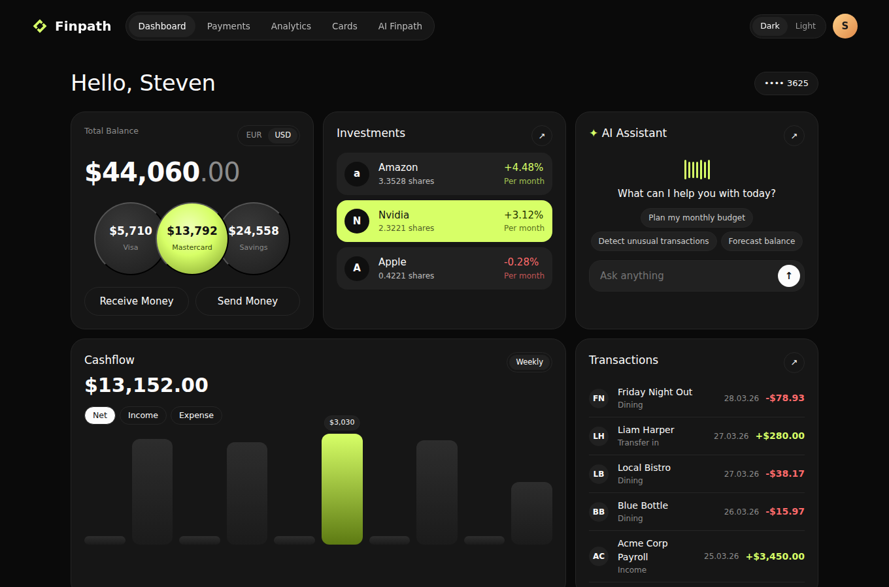
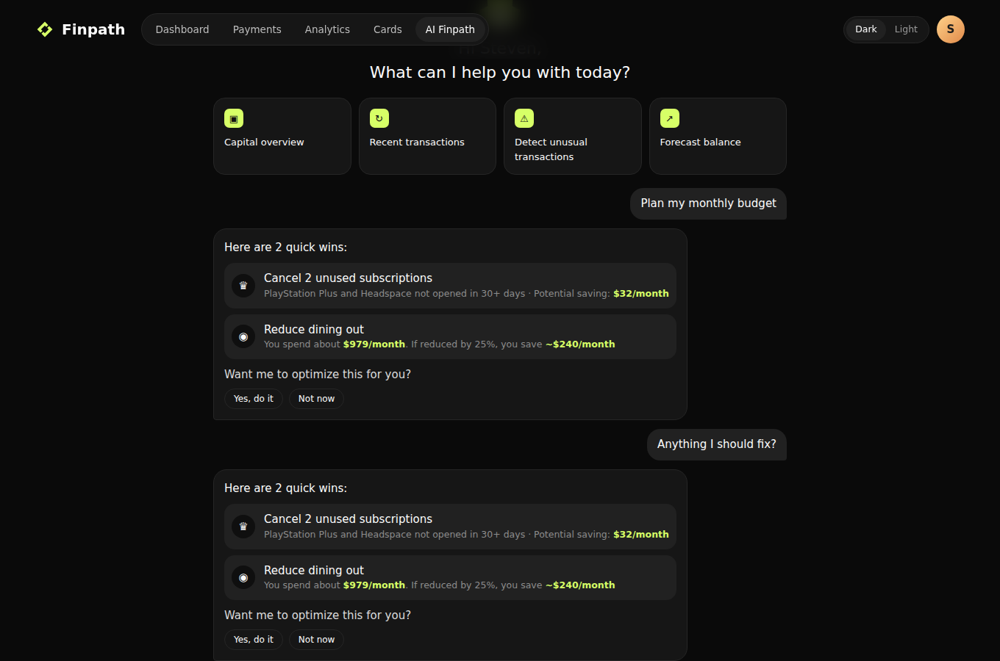
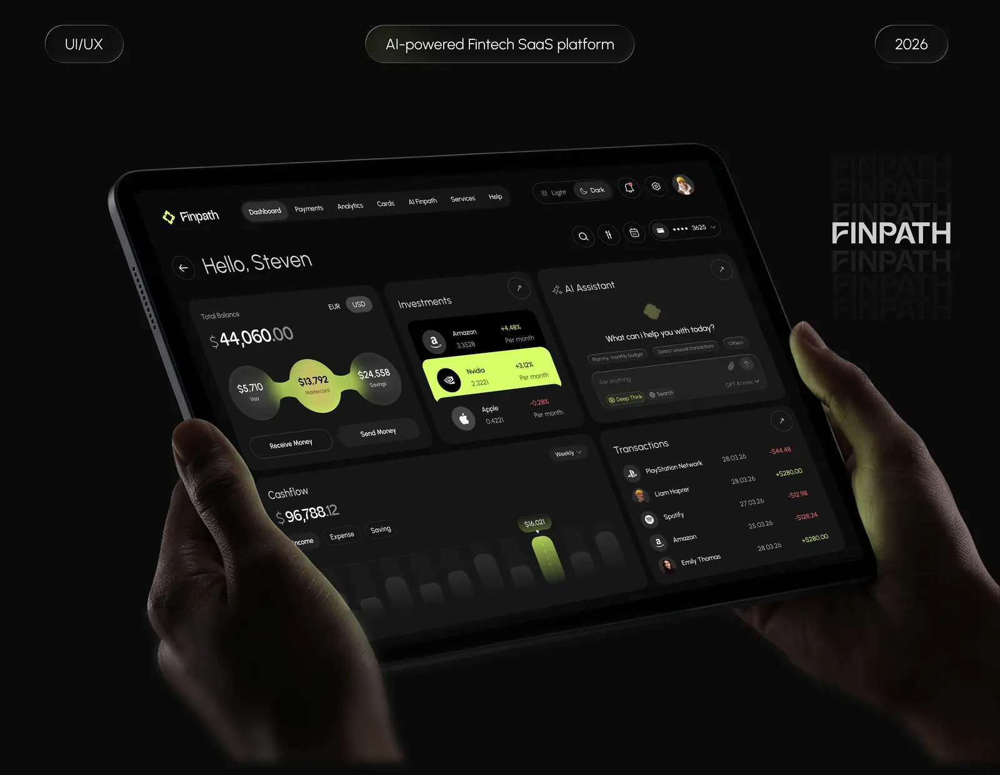
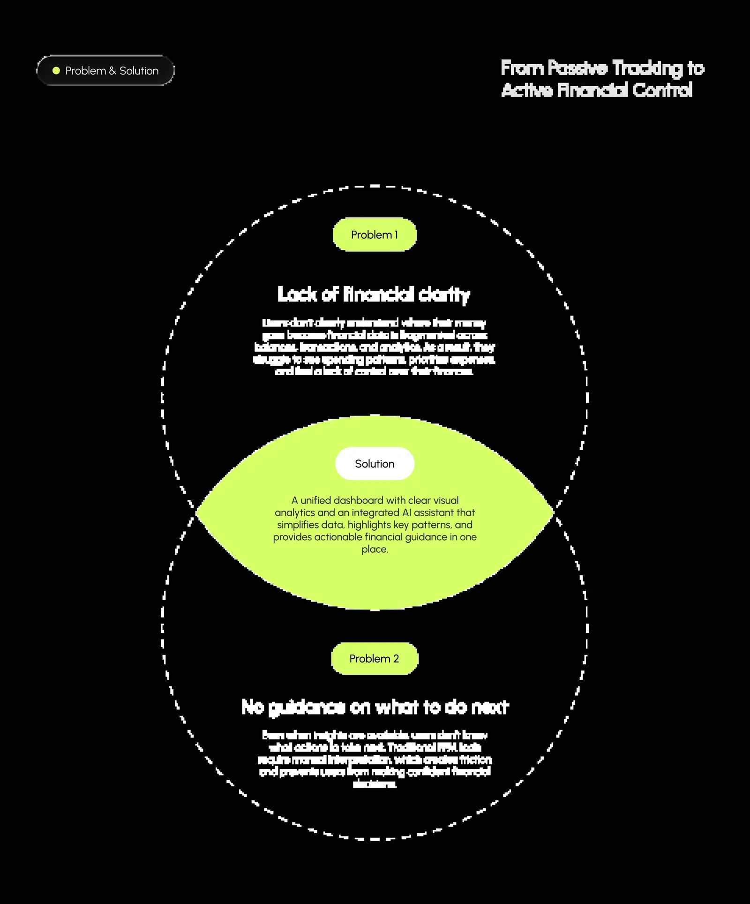
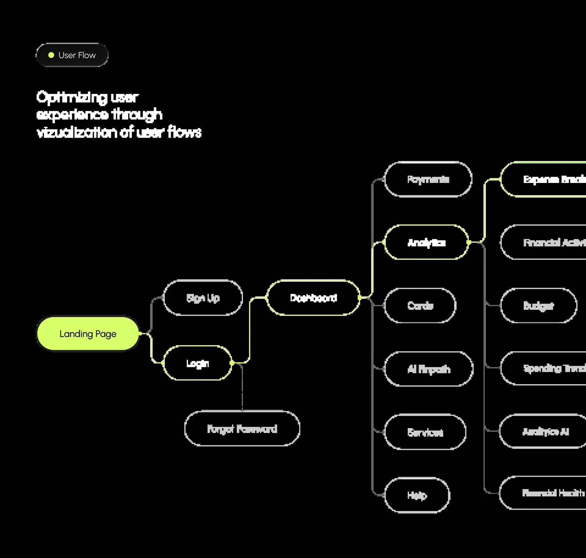
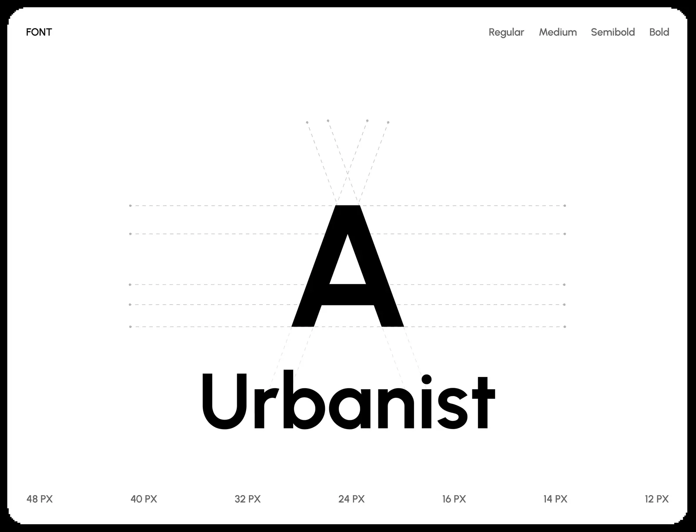
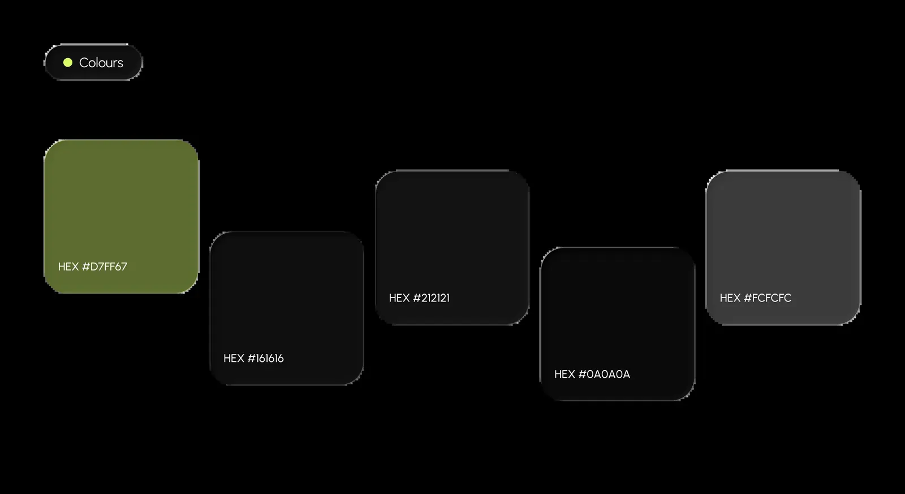

# Finpath

**An AI-powered financial ecosystem: spending intelligence, card management and real-time analytics, with an assistant that tells you what to do next.** This repo is the coded, clickable prototype of the Finpath UX/UI case study, built to the case study's design system.

**[Open the prototype →](https://murtuzabuilds.github.io/finpath/)** &nbsp;·&nbsp; [Case study](https://murtuzabuilds.com/#portfolio)



## The problem

People don't clearly understand where their money goes, because financial data is scattered across balances, transactions and analytics. Even when insights exist, traditional tools leave people guessing what to do next.

**Two problems, one answer:** a unified dashboard with an AI assistant at its core.

## What's in the prototype

| Screen | What works |
|---|---|
| **Dashboard** | Total balance built from three accounts (Visa, Mastercard, Savings), investments, a weekly cashflow chart you can switch between net, income and expense, and recent transactions |
| **AI Finpath** | Ask in plain language. The assistant runs real analysis on 90 days of sample transactions: finds unused subscriptions, sizes a dining cut, flags unusual spending, forecasts your balance and breaks down categories |
| **Analytics** | Spend-by-category donut and a financial-health summary |
| **Cards** | Freeze and unfreeze each card |
| **Payments** | Send-money flow with balance checks, and the full transaction history |

The assistant's two headline wins come from the case study and are computed, not hard-coded:

- **Cancel 2 unused subscriptions → $32/month:** subscriptions not opened in 30+ days.
- **Reduce dining out by 25% → ~$240/month:** based on the sample data's dining spend of about $979 a month (the case study used ~$250).



## How the assistant thinks

`src/insights.js` holds the reasoning as small, testable functions, so the "AI" is inspectable:

| Function | What it does |
|---|---|
| `unusedSubscriptions()` | Subscriptions unused for 30+ days and their monthly total |
| `trim(category, share)` | Monthly spend in a category and the saving from a cut |
| `unusual()` | Outflows more than 3 standard deviations above normal (it catches the $1,249 ElectroMart purchase) |
| `forecast()` | Straight-line balance projection from 90 days of net flow |
| `answer(question)` | Routes a plain-language question to the right analysis and phrases the reply |

In production the routing and phrasing would come from an LLM with these functions as tools. The numbers would still come from code, which is the point: **the model explains and the math decides.**

## Design system

From the case study, as tokens in [`tokens/design-tokens.json`](tokens/design-tokens.json) and [`tokens/tokens.css`](tokens/tokens.css):

| Token | Value | Use |
|---|---|---|
| Lime | `#D7FF67` | Brand accent, AI moments, positive values |
| Black | `#0A0A0A` | Background |
| Surface 1 / 2 | `#161616` / `#212121` | Panels, raised elements |
| White | `#FCFCFC` | Text |
| Type | Urbanist | Everything |

The logomark (a lime diamond path) is redrawn as an inline SVG.

## Case study

| | |
|---|---|
|  |  |
|  |  |
|  |  |

## Run it

```bash
git clone https://github.com/murtuzabuilds/finpath && cd finpath
npm test     # 6 tests on the assistant's analysis
npm start    # or open index.html through any static server
```

No dependencies and no build step. All transactions, people and merchants are sample data generated from a fixed seed.

---

Designed and built by [Murtuza](https://murtuzabuilds.com). MIT licensed.
